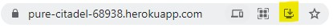
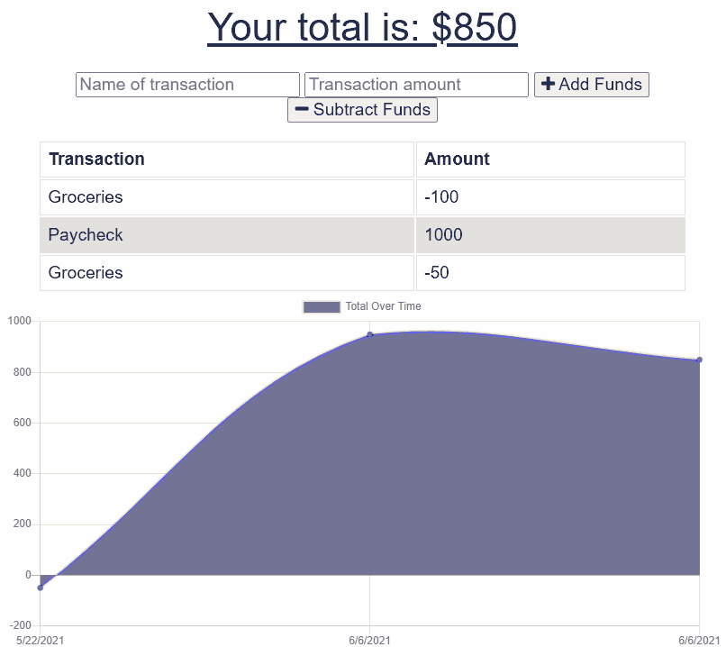

# Budget Tracker

## Description

This is a simple budget tracker application set up to be a progressive web application. A deployed version is available [here](https://pure-citadel-68938.herokuapp.com/).

## Installation

To install and run this application locally:

1. Make sure you have [node.js](https://nodejs.dev/) installed on your local machine.
2. Then clone or download the repository. Navigate to the root directory of the copy in your CLI and run the following to install all required dependencies:
```
    npm install
```
3. You will need to have a MongoDB server installed on your local machine to access the data. You can install the community version [here](https://www.mongodb.com/try/download/community).
4. Finally, run the following to start the server on localhost 3000:
```
    npm start
```

Installation can alternatively be done by visiting the deployed link and, clicking the highlighted icon, and downloading the application through your browser.



## Usage

* Type in your expense name, and money (numbers only).
* Click add funds or subtract funds to respectively add or subtract funds from your balance.
* By default, the application will not be seeded with data.

## Demo

